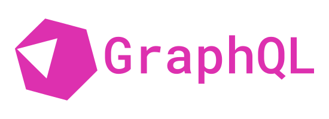

GraphQL server library for Crystal.

- **Boilerplate-free**: Schema is generated at compile time
- **Type-safe**: Relies on the Crystal compiler for type checking
- **High performance**: Benchmarks TBD

The language implementation is derived from
[ziprandom/graphql-crystal](https://github.com/ziprandom/graphql-crystal), the
rest was built from the ground up. How they compare:

|                             | graphql-crystal/graphql | ziprandom/graphql-crystal |
| --------------------------- | ----------------------- | ------------------------- |
| Type-safe                   | :heavy_check_mark:      | :x:                       |
| Automatic schema derivation | :heavy_check_mark:      | :x:                       |
| Actively developed          | :heavy_check_mark:      | :x:                       |
| Supports interfaces         | :x:                     | :heavy_check_mark:        |
| Supports subscriptions      | :x:                     | :x:                       |

## Getting Started

Install the shard by adding the following to our `shard.yml`:

```yaml
dependencies:
  graphql:
    github: graphql-crystal/graphql
```

Then run `shards install`.

The first step is to define a query object. This is the root type for all
queries and it looks like this:

```crystal
require "graphql"

@[GraphQL::Object]
class Query < GraphQL::BaseQuery
  @[GraphQL::Field]
  def hello(name : String) : String
    "Hello, #{name}!"
  end
end
```

Now we can create a schema object:

```crystal
schema = GraphQL::Schema.new(Query.new)
```

To verify we did everything correctly, we can print out the schema:

```crystal
puts schema.document.to_s
```

Which, among several built-in types, prints our query type:

```graphql
type Query {
  hello(name: String!): String!
}
```

Now for the integration with our HTTP library or framework. All we need to do is
to call `schema.execute` with the right arguments. Here is a simple example for
Kemal, customize as needed:

```crystal
post "/graphql" do |env|
  env.response.content_type = "application/json"

  query = env.params.json["query"].as(String)
  variables = env.params.json["variables"]?.as(Hash(String, JSON::Any)?)
  operation_name = env.params.json["operationName"]?.as(String?)

  schema.execute(query, variables, operation_name)
end
```

Now we're ready to query our API:

```bash
curl \
  -X POST \
  -H "Content-Type: application/json" \
  --data '{ "query": "{ hello(name: \"John Doe\") }" }' \
  http://0.0.0.0:3000/graphql
```

This should return:

```json
{ "data": { "echo": "Hello, John Doe!" } }
```

For easier development, we recommend using [GraphiQL](https://github.com/graphql/graphiql).
A starter template combining Kemal and GraphiQL can be found at `examples/graphiql`.

## Context

`context` is a optional argument that our fields can retrieve. It lets fields
access global data like database connections.

```crystal
# Define our own context type
class MyContext < GraphQL::Context
  @pi : Float64
  def initialize(@pi)
  end
end

# Pass it to schema.execute
context = MyContext.new(Math.PI)
schema.execute(query, variables, operation_name, context)

# Access it in our fields
@[GraphQL::Object]
class MyMath < GraphQL::BaseObject
  @[GraphQL::Field]
  def pi(context : MyContext) : Float64
    context.pi
  end
end
```

Context instances should only be used once, do not reuse them for multiple
executes.

## Objects

Objects are perhaps the most commonly used type in GraphQL. They are implemented
as classes. To define a object, we need a `GraphQL::Object` annotation and to inherit
`GraphQL::BaseObject`. Fields are methods with a `GraphQL::Field` annotation.

```crystal
@[GraphQL::Object]
class Foo < GraphQL::BaseObject
  @[GraphQL::Field]
  def hello(first_name : String, last_name : String) : String # explicit types are mandatory
    "Hello #{first_name} #{last_name}"
  end

  @[GraphQL::Field]
  def bar : Bar # in addition to basic types, we can also return other objects
    Bar.new
  end
end

@[GraphQL::Object]
class Bar < GraphQL::BaseObject
  @[GraphQL::Field]
  def baz : Float64
    42_f64
  end
end
```

## Query

Query is the root type of all queries.

```crystal
@[GraphQL::Object]
class Query < GraphQL::BaseQuery
  @[GraphQL::Field]
  def echo(str : String) : String
    str
  end
end

schema = GraphQL::Schema.new(Query.new)
```

## Mutation

Mutation is the root type for all mutations.

```crystal
@[GraphQL::Object]
class Mutation < GraphQL::BaseMutation
  @[GraphQL::Field]
  def echo(str : String) : String
    str
  end
end

schema = GraphQL::Schema.new(Query.new, Mutation.new)
```

## Input Objects

Input objects are objects that are used as field arguments. To define a input
object, use a `GraphQL::InputObject` annotation and inherit `GraphQL::BaseInputObject`.
It must define a constructor with a `GraphQL::Field` annotation.

```crystal
@[GraphQL::InputObject]
class User < GraphQL::BaseInputObject
  getter first_name : String?
  getter last_name : String?

  @[GraphQL::Field]
  def initialize(@first_name : String?, @last_name : String?)
  end
end
```

## Enums

Defining enums is very straightforward, just add a `GraphQL::Enum` annotation.

```crystal
@[GraphQL::Enum]
enum IPAddressType
  IPv4
  IPv6
end
```

## Scalars

The following scalar values are supported:

- Int32 -> Int
- Float64 -> Float
- String -> String
- Bool -> Boolean
- GraphQL::Scalars::ID -> ID

Built-in custom scalars:

- GraphQL::Scalars::BigInt

Custom scalars can be created by implementing from_json/to_json:

```crystal
@[GraphQL::Scalar]
class ReverseStringScalar < GraphQL::BaseScalar
  @value : String

  def initialize(@value)
  end

  def self.from_json(string_or_io)
    self.new(String.from_json(string_or_io))
  end

  def to_json(builder : JSON::Builder)
    builder.scalar(@value.reverse)
  end
end
```

## Interfaces

Interfaces are not supported.

## Subscriptions

Subscriptions are not supported.

## Annotation Arguments

### name

Supported on: `Object`, `InputObject`, `Field`, `Enum`, `Scalar`

We can use the `name` argument to customize the introspection type name of a
type. This is not needed in most situations because type names are automatically
converted to PascalCase or camelCase. However, `item_id` is converted to
`itemId`, but we might want to use `itemID`. For this, we can use the `name`
argument.

```crystal
@[GraphQL::Object(name: "Sheep")]
class Wolf
  @[GraphQL::Field(name: "baa")]
  def howl : String
    "baa"
  end
end
```

### description

Supported on: `Object`, `InputObject`, `Field`, `Enum`, `Scalar`

Describes the type. This is made available through the introspection interface
so it's always a good idea to set this argument.

```crystal
@[GraphQL::Object(description: "I'm a sheep, I promise!")]
class Wolf
end
```

### deprecated

Supported on: `Field`

The deprecated argument is set to mark a type as deprecated.

```crystal
class Sheep
  @[GraphQL::Field(deprecated: "This was a bad idea.")]
  def fight_wolf : String
    "Wolf ate sheep"
  end
end
```

### arguments

A hash that is used to set names and descriptions for field arguments. Note that
arguments cannot be deprecated as of the latest GraphQL spec (June 2018).

```crystal
class Sheep
  @[GraphQL::Field(arguments: {weapon: {name: "weaponName", description: "The weapon the sheep should use."}})]
  def fight_wolf(weapon : String) : String
    if weapon == "Atomic Bomb"
      "Sheep killed wolf"
    else
      "Wolf ate sheep"
    end
  end
end
```

## Field Arguments

Field arguments are automatically resolved. A type with a default value becomes
optional. A nilable type is also considered a optional type.
